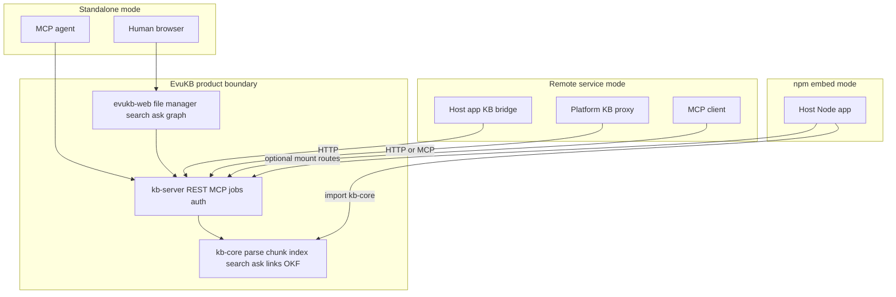
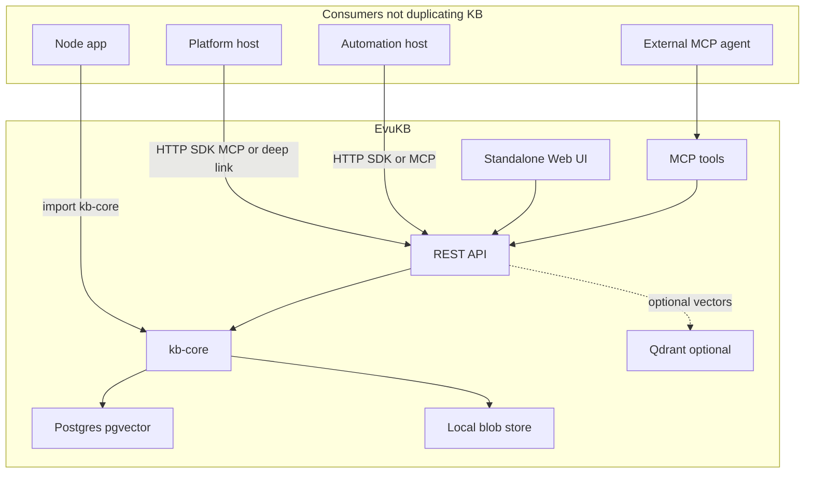
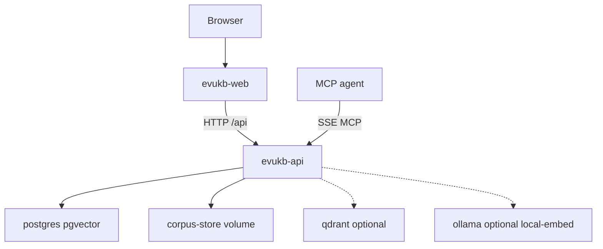
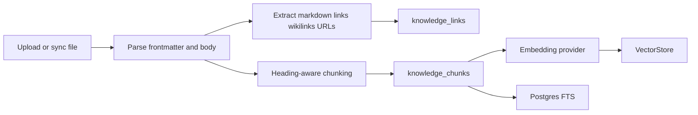

# EvuKB Product and Engineering Specification

Status: implemented through P0–P2 and most of P3 hardening; maintained as the
product and engineering source of truth. Phase-level shipped/open status lives
in [`docs/ROADMAP.md`](docs/ROADMAP.md).

EvuKB is a standalone, open-source knowledge base and RAG system. It is designed
to run as a complete product for humans and AI agents, or to be reused by other
projects as a remote service or npm dependency.

This document is intentionally implementation-oriented. It defines EvuKB
product boundaries, contracts, and engineering decisions for standalone and
embedded use.

---

## 1. Summary, Mission, And Non-Goals

Working name:

```text
EvuKB
```

Alternate names and slugs:

```text
evu-knowledgebase
@evu/kb
```

Mission:

```text
EvuKB does one thing well: knowledge.
```

EvuKB ingests, stores, links, searches, cites, and answers from knowledge
corpora. It is not an agent orchestrator, not an infrastructure service map, not
a general extension platform, and not an all-purpose database.

EvuKB provides:

- multi-workspace knowledge corpora
- file manager and document editor
- markdown parsing, chunking, frontmatter, links, wikilinks
- optional OKF profile support
- hybrid search
- RAG ask with citations
- knowledge graphs and link navigation
- HTTP API
- MCP tools
- agent write tools with approval policy
- standalone Web UI
- embeddable TypeScript packages

Non-goals:

| In scope | Out of scope |
| --- | --- |
| corpora, files, chunks, links, search, ask, graph | agent orchestration triggers, runs, sandboxes |
| MCP and HTTP agent tools for knowledge | generic extension platform runtime |
| multi-workspace isolation | host organizations, collectors, service maps, timelines |
| optional git and mount sync | MinIO/S3 as a v1 blob dependency |
| corpus `agent-notes/` writes | full agent memory-bank product in v1 |

Target license:

- MIT (see repository `LICENSE`).

---

## 2. Naming And Identifiers

Display name:

```text
EvuKB
```

Repository path:

```text
evukb/
```

Environment prefix:

```text
EVUKB_*
```

Queue prefix:

```text
evu-kb-*
```

Default package names:

| Package | Purpose |
| --- | --- |
| `@evu/kb-core` | domain logic and stable contracts |
| `@evu/kb-db` | Drizzle schema and migrations |
| `@evu/kb-server` | HTTP, MCP, jobs, adapter wiring |
| `@evu/kb-sdk` | generated TypeScript client |
| `@evu/kb-ui` | optional future embeddable React UI components |

Standalone service names:

| Service | Purpose |
| --- | --- |
| `evukb-api` | REST, MCP, jobs |
| `evukb-web` | standalone Web UI |
| `postgres` | application database, pgvector, pg-boss |
| `qdrant` | optional vector backend |

---

## 3. Integration Modes

EvuKB must support three consumption shapes with the same semantic contract.

| Mode | Consumer | Interface | Notes |
| --- | --- | --- | --- |
| standalone product | humans and agents | Web UI, HTTP, MCP | default Docker Compose deployment |
| remote service | host applications and agents | OpenAPI HTTP and MCP | least-coupled integration mode |
| npm embed | Node.js apps | `@evu/kb-core`, later `@evu/kb-server` | host app brings policy and process lifecycle |

Priority:

1. Standalone product and remote service are first-class for P0/P1.
2. `@evu/kb-core` is the initial npm embed surface.
3. In-process `@evu/kb-server` embedding is specified but can ship after the
   remote API stabilizes.



Stability rule:

- `@evu/kb-core` public APIs are versioned and treated as stable earlier than
  server internals.
- HTTP OpenAPI and MCP tool schemas are public contracts.
- `@evu/kb-server` exposes a composable server adapter, but standalone process
  behavior stays in `apps/api`.

---

## 4. Design Philosophy

EvuKB is format-first and product-second.

Core values:

- Files are portable.
- Markdown remains readable without EvuKB.
- OKF is optional, not mandatory.
- Search and RAG cite source chunks.
- Ranking strategy is configurable and replaceable.
- The default stack should be easy to self-host.
- Headless operation should be as complete as UI operation.
- Agents are untrusted writers unless granted explicit capabilities.

Default mental model:

```text
Collect files -> Parse and link -> Index chunks -> Search or ask -> Cite sources
```

EvuKB should avoid product sprawl. Features belong here only if they directly
support knowledge-base or RAG workflows.

---

## 5. Host Application Boundaries

EvuKB owns KB/RAG:

- corpora
- files
- chunks
- links
- OKF
- hybrid search
- ask with citations
- KB graphs
- KB MCP tools

Out of scope for EvuKB (host applications own these):

- agent orchestration (triggers, filters, runs, sandboxes, memory banks)
- generic extension platforms (service maps, collectors, timelines, platform MCP gateways)

Dependency direction:

- Host applications call EvuKB for KB/RAG through HTTP, MCP, or a thin SDK.
- Host-specific adapter code belongs in the consuming project by default.
- EvuKB exposes generic contracts, examples, and test fixtures.



---

## 6. Package Layout And Public Stability

Proposed monorepo layout:

```text
apps/
  api/
  web/

packages/
  kb-core/
  kb-db/
  kb-server/
  kb-sdk/
  kb-ui/          # optional future package

deploy/
  docker-compose.yml
  docker-compose.dev.yml
  docker-compose.local.example.yml

docs/
  # future companion docs

Makefile
.env.example
SPEC.md
```

Package boundaries:

| Package / app | Responsibility | Must not own |
| --- | --- | --- |
| `@evu/kb-core` | markdown parse, chunking, links, OKF helpers, ranking utilities, shared contracts | HTTP, auth, pg-boss lifecycle, process globals |
| `@evu/kb-db` | Drizzle schema, migrations, typed DB helpers | Web UI, MCP, LLM provider calls |
| `@evu/kb-server` | Fastify routes, MCP adapter, jobs, storage/vector adapter wiring | product-specific host policy beyond KB |
| `@evu/kb-sdk` | generated OpenAPI client, auth helpers | business logic |
| `@evu/kb-ui` | optional embeddable React components | required runtime dependency for headless users |
| `apps/api` | standalone API process composing `kb-server` | reusable domain logic |
| `apps/web` | standalone KB UI | required dependency for library users |

Public stability:

- `@evu/kb-core` public types and functions use semver.
- OpenAPI paths use semver and deprecation windows.
- MCP tool schemas are versioned.
- Internal database helpers can change behind migrations.
- UI component package is optional and should not block core API stability.

---

## 7. Settings Model And Precedence

All operator-facing settings must be available in both headless and standalone
forms.

Settings surfaces:

| Surface | Use case |
| --- | --- |
| environment variables | Docker, CI, embedded server boot |
| config file | headless deployments and dependency mode |
| database settings | standalone Web UI and runtime changes |
| request overrides | admin/API experiments and tests |

Precedence:

```text
explicit request override
-> workspace or corpus database setting
-> config file
-> environment variable
-> built-in default
```

Static boot settings:

| Setting | Example env |
| --- | --- |
| API host and port | `EVUKB_HOST`, `EVUKB_API_PORT` |
| public Web origin | `EVUKB_WEB_ORIGIN` |
| database URL | `EVUKB_DATABASE_URL` |
| blob root | `EVUKB_BLOB_ROOT` |
| vector backend enabled at boot | `EVUKB_VECTOR_BACKEND` |
| qdrant URL | `EVUKB_QDRANT_URL` |
| log level | `EVUKB_LOG_LEVEL` |

Runtime UI settings:

| Setting | Scope |
| --- | --- |
| embedding provider and model | workspace or corpus |
| LLM provider and model | workspace |
| ranking strategy and weights | workspace, corpus, request |
| OKF profile and OKF maintenance settings | corpus |
| mount and git sync | corpus |
| agent mutation approval policy | workspace and corpus |
| citation validation policy | workspace and corpus |

Sensitive settings:

- API keys, git credentials, and provider secrets are stored as secrets.
- Secrets are never returned to UI or agents after creation.
- Config file can reference secret names but should not contain plaintext
  secrets by default.

The UI should show whether a setting is inherited from env/config or overridden
in the database.

---

## 8. Runtime Dependencies

Default required services:

| Service | Role | Required |
| --- | --- | --- |
| PostgreSQL 17 + pgvector | metadata, chunks, FTS, default vectors, pg-boss queues | yes |
| local filesystem | corpus blob store | yes |
| EvuKB API process | REST, MCP, jobs | yes |
| EvuKB Web app | standalone human UI | yes for standalone |

Optional services:

| Service | Role | Default |
| --- | --- | --- |
| Qdrant | optional vector backend | disabled |
| Ollama (`local-embed` profile) | optional local OpenAI-compatible embeddings | disabled |
| external OpenAI-compatible embedding provider | real embeddings | optional |
| local OpenAI-compatible provider | local embeddings/LLM | optional |

Explicitly omitted by default:

| Service | Reason |
| --- | --- |
| Redis | pg-boss uses Postgres for queues |
| MinIO | local filesystem is simpler for self-hosted corpus storage |
| separate worker container | API process can run jobs in v1 |
| separate MCP container | MCP can mount into the API process |

---

## 9. Docker Compose And Makefile Structure

Compose files:

| File | Purpose |
| --- | --- |
| `deploy/docker-compose.dev.yml` | local dev stack with bind mounts and hot reload |
| `deploy/docker-compose.yml` | production stack with built images and persistent volumes |
| `deploy/docker-compose.local.example.yml` | gitignored local overrides for mounts, ports, provider endpoints |

Default services:

| Service | Dev | Prod | Notes |
| --- | --- | --- | --- |
| `postgres` | required | required | PostgreSQL 17 with pgvector |
| `evukb-api` | required | required | REST, MCP, pg-boss jobs in one process |
| `evukb-web` | required for standalone | required for standalone | Vite in dev, static/nginx image in prod |
| `qdrant` | optional profile | optional profile | only with `EVUKB_VECTOR_BACKEND=qdrant` |
| `ollama` | optional profile | optional profile | only with `local-embed` profile; set `EVUKB_EMBEDDING_*` to sidecar URL |



Volumes:

| Volume | Purpose |
| --- | --- |
| `pgdata` | PostgreSQL data |
| `corpus_store` | file bytes and exports |
| `qdrant_data` | optional vector storage |
| `ollama_data` | optional local embedding models |

Make targets:

| Target | Behavior |
| --- | --- |
| `make dev` | start dev compose foreground with API and web hot reload |
| `make dev-local-embed` | start dev compose with optional Ollama embedding sidecar |
| `make up` | detached dev stack |
| `make down` | stop stack |
| `make prod` | production compose using `.env` |
| `make migrate` | run Drizzle migrations |
| `make test` | unit, integration, and typecheck |
| `make verify-dev` | build/start dev stack, migrate, health-check API, Web, MCP, and upload/search smoke test |
| `make generate-openapi` | refresh OpenAPI and SDK |

Verification rule:

- For code changes, `make test` and `make verify-dev` must pass before claiming
  completion.
- For SPEC-only work, runtime verification is not required.

---

## 10. Storage Adapter Contracts

EvuKB should define storage interfaces before implementation details.

| Adapter | v1 implementation | Purpose |
| --- | --- | --- |
| `BlobStore` | local filesystem | file bytes, streams, checksums, zip export |
| `MetadataStore` | Postgres + Drizzle | corpora, nodes, chunks, links, auth, audit |
| `VectorStore` | pgvector default, Qdrant optional | vector index/delete/search |
| `JobQueue` | pg-boss default, in-process test queue | indexing, sync, OKF maintenance |
| `EmbeddingProvider` | OpenAI-compatible first | chunk embeddings |
| `LLMProvider` | OpenAI-compatible first | Ask/RAG generation |

`BlobStore` minimum interface:

```ts
interface BlobStore {
  put(input: PutBlobInput): Promise<BlobRef>;
  get(ref: BlobRef): Promise<ReadableStream>;
  stat(ref: BlobRef): Promise<BlobStat>;
  delete(ref: BlobRef): Promise<void>;
  list(prefix: string): AsyncIterable<BlobStat>;
}
```

`VectorStore` minimum interface:

```ts
interface VectorStore {
  upsertChunks(input: VectorUpsertInput): Promise<void>;
  deleteChunks(input: VectorDeleteInput): Promise<void>;
  search(input: VectorSearchInput): Promise<VectorSearchHit[]>;
  health(): Promise<VectorStoreHealth>;
}
```

All adapters must preserve workspace scope. Vector payloads must include
workspace and corpus filters even when the vector store is external.

---

## 11. Schema, Versioning, And Reindex Rules

Migrations:

- Drizzle migrations are forward-only.
- Schema changes use explicit migrations.
- Generated OpenAPI and SDK updates happen in the same change as API shape
  changes.

Version fields:

| Field | Scope | Purpose |
| --- | --- | --- |
| `corpus_schema_version` | corpus | data shape compatibility |
| `parser_version` | node/chunk | markdown parser changes |
| `chunker_version` | chunk | chunk algorithm changes |
| `okf_profile_version` | corpus/node | OKF validation behavior |
| `embedding_model_id` | chunk/corpus | model provenance |
| `embedding_dimensions` | chunk/corpus | vector dimension compatibility |
| `vector_backend` | corpus/index | pgvector vs Qdrant |
| `ranking_strategy_id` | corpus/search result | ranking reproducibility |

Reindex when:

- parser or chunker version changes
- embedding model or dimensions change
- vector backend changes
- OKF profile settings change
- link parser changes
- file content hash changes

Chunk identity:

- Stable when corpus ID, path, content hash, chunker version, and ordinal remain
  stable.
- If an import or reindex changes chunk IDs, expose migration metadata linking
  old IDs to new IDs when possible.

Embedding dimension migration:

- pgvector columns and indexes are dimension-specific.
- Switching dimensions requires a planned reindex and compatible migration.
- Qdrant collection naming should include model and dimensions.

---

## 12. Vector Backend Design

Vector backend:

```text
EVUKB_VECTOR_BACKEND=pgvector | qdrant
```

Default:

```text
pgvector
```

Adapters:

| Backend | Source reference | Notes |
| --- | --- | --- |
| pgvector | EvuKB hybrid search adapter | default, one DB |
| Qdrant | optional Qdrant vector adapter | optional extra service |

Tradeoffs:

| Dimension | pgvector | Qdrant |
| --- | --- | --- |
| operations | one database | extra service |
| local dev | simplest | more moving parts |
| hybrid search | native SQL merge with FTS | dual query plus merge |
| scale | good for self-hosted and small teams | better for larger vector workloads |
| backup | Postgres dump plus blobs | Postgres, blobs, and Qdrant storage |
| v1 status | required | optional profile |

Recommendation:

- pgvector remains the default vector backend.
- Qdrant remains an officially supported optional profile (`EVUKB_VECTOR_BACKEND=qdrant`, docker `qdrant` profile).
- pgvector and Qdrant adapters must stay comparable through the same ranking contract (see Sprint 19 parity tests).

Qdrant adapter rules:

- collection per embedding model/dimension
- mandatory workspace filter
- mandatory corpus filter
- pointer-only payloads
- chunk body remains in Postgres/blob metadata, not in Qdrant

---

## 13. Ranking Strategy Registry And Search Semantics

Ranking must be decoupled from vector storage.

```ts
type RankingStrategy = {
  id: string;
  version: string;
  label?: string;
  description?: string;
  retrieval: { keyword: boolean; semantic: boolean };
  rank: (candidates: RankingCandidate[], weights?: HybridRankingWeights) => RankedSearchHit[];
  postRank?: string; // handler key, e.g. "llm"
  builtin?: boolean;
};

type RankingStrategyRegistry = {
  register(strategy: RankingStrategy, options?: { force?: boolean }): void;
  unregister(strategyId: string): void;
  get(strategyId: string): RankingStrategy | undefined;
  resolve(strategyId: string): RankingStrategy;
  list(): RankingStrategy[];
  isBuiltin(strategyId: string): boolean;
};
```

Default v1 strategy:

```text
hybrid_default_v1
```

Reference implementation: EvuKB `packages/kb-server` search service.

Strategy registry (built-in):

| Strategy | Status | Purpose |
| --- | --- | --- |
| `hybrid_default_v1` | v1 default | hybrid keyword + semantic ranking |
| `semantic_only` | v1 | vector hits only |
| `keyword_only` | v1 | FTS only |
| `recency_boosted` | v1 | favor recent files |
| `citation_boosted` | v1 | favor OKF citation sections |
| `reranker_llm` | v1 | hybrid retrieval + LLM post-rank |

### Plugin API (F-4)

- Hosts and operators may register additional strategies via
  `createRankingStrategyRegistry({ extensions: [...] })` at boot or via
  `POST /api/workspaces/{id}/settings/ranking/strategies` when
  `EVUKB_ENABLE_RANKING_PLUGIN_RELOAD=true`.
- Plugin administration requires **`kb:admin`** scope (not `kb:write`).
- Uninstall previews affected corpora; confirm remediation resets corpus overrides
  to the workspace default and workspace default to `hybrid_default_v1` when needed.
- Custom `rank()` functions require boot-time registration or allowlisted `importPath`;
  JSON `preset` descriptors support hybrid weight templates only.
- Example package: `examples/custom-ranking-strategy/`.

Settings:

| Setting | Scope |
| --- | --- |
| `rankingStrategyId` | workspace, corpus, request |
| `rankingSettings.keywordWeight` | workspace, corpus, request |
| `rankingSettings.semanticWeight` | workspace, corpus, request |
| `rankingSettings.recencyBoost` | workspace, corpus, request |
| `rankingSettings.pathBoosts` | corpus, request |
| `rankingSettings.okfCitationBoost` | corpus, request |
| `rankingSettings.exactTitleBoost` | workspace, corpus, request |

Search filters:

- corpus IDs
- path prefix
- path allowlist
- file type
- frontmatter fields
- tags
- OKF type
- source type
- indexed status

Search result shape:

```ts
type SearchResult = {
  chunkId: string;
  nodeId: string;
  corpusId: string;
  workspaceId: string;
  filePath: string;
  headingPath: string[];
  bodyPreview: string;
  score: number;
  matchKind: "keyword" | "semantic" | "both";
  citation: Citation;
  ranking: {
    strategyId: string;
    strategyVersion: string;
    componentScores: Record<string, number>;
  };
};
```

Testing:

- Golden fixtures: ranking, citations, OKF, and links (`packages/kb-core/test/fixtures/*-golden.ts`).
- Workspace isolation goldens exist: `packages/kb-core/test/isolation-golden.test.ts`
  plus the `workspace isolation golden` suite in
  `packages/kb-server/test/integration.test.ts` (HTTP-level, DB-backed).
- Optional Qdrant verification: `make verify-qdrant` (requires `EVUKB_DATABASE_URL` +
  `EVUKB_QDRANT_URL`; not part of default `verify-dev`).
- pgvector and Qdrant adapters must be comparable through the same ranking
  contract.

---

## 14. Tenancy, Auth, And Secrets

EvuKB is multi-workspace from v1.

Entities:

| Entity | Purpose |
| --- | --- |
| `User` | human account |
| `Workspace` | isolation boundary |
| `WorkspaceMember` | role in workspace |
| `ApiKey` | API access |
| `McpToken` | MCP access |
| `Secret` | provider, git, and integration secrets |

Minimum roles:

| Role | Permissions |
| --- | --- |
| Owner | all workspace actions |
| Admin | corpus, settings, keys, sync |
| Editor | file and corpus edits |
| Viewer | read/search/ask |
| Agent | scoped tool access |

Workspace isolation:

- Every SQL query filters by `workspace_id`.
- Every vector search filters by `workspace_id`.
- Every blob access validates workspace ownership through metadata.
- Every MCP call carries a workspace context.
- Cross-workspace access is a release-blocking bug.

Auth surfaces:

- local password auth in standalone mode
- API keys for server-to-server usage
- MCP bearer tokens for agents
- optional OIDC later

Secret rules:

- Store secret values encrypted.
- Never log secret values.
- Never return secret values after creation.
- Git credentials and provider API keys are referenced by secret name.

---

## 15. Data Model

Core tables:

| Table | Purpose |
| --- | --- |
| `users` | human accounts |
| `workspaces` | tenant boundary |
| `workspace_members` | RBAC |
| `knowledge_corpora` | corpus metadata and settings |
| `knowledge_nodes` | folder/file tree and source metadata |
| `knowledge_chunks` | indexed text chunks |
| `knowledge_links` | markdown, wikilink, and URL edges |
| `api_keys` | API auth |
| `mcp_tokens` | MCP auth |
| `secrets` | encrypted secret values |
| `audit_log` | human and agent mutation trail |

`knowledge_corpora` key fields:

```text
id
workspace_id
name
description
settings jsonb
embedding_provider_id
embedding_model_id
ranking_strategy_id
file_count
chunk_count
total_bytes
created_at
updated_at
```

`knowledge_nodes` key fields:

```text
id
workspace_id
corpus_id
parent_id
path
name
node_type                # folder | file
storage_rel_path
source_type              # managed | shared_mount | git | reference
source_ref
content_hash
mime_type
size_bytes
index_status             # pending | indexing | indexed | stale | failed
metadata jsonb
created_at
updated_at
indexed_at
```

`knowledge_chunks` key fields:

```text
id
workspace_id
corpus_id
node_id
ordinal
file_path
folder_path
heading_path
body
body_preview
token_count
embedding vector(N)      # pgvector backend
external_vector_id       # qdrant backend
metadata jsonb
indexed_at
```

`knowledge_links` key fields:

```text
id
workspace_id
corpus_id
from_node_id
to_node_id
link_kind                # markdown | wikilink | autolink | citation | external
raw
target_path
external_url
resolved
metadata jsonb
created_at
```

Cross-cutting KB concepts to preserve:

- source-grounded ask answers
- grouped search context
- relationship graph navigation
- typed citations

The standalone schema should not become a generic entity platform in v1.
EvuKB is corpus-first, not a generic entity platform.

---

## 16. Memory Vs Knowledge Boundary

Memory is adjacent to knowledge, but not identical.

| Concept | Prior automation platform | Prior platform runtime | EvuKB decision |
| --- | --- | --- | --- |
| knowledge corpus | P10 corpora | `evu.documents`, `evu.search.qdrant`, `evu.ask` | core |
| agent memory bank | P4 memory banks | `evu.memory` | **out of scope** |
| agent notes in corpus | `agent-notes/` prefix | partial overlap | core write path |

### Decision (F-1)

EvuKB is **knowledge only**. Full memory banks are **not** in scope for this
repository.

- Corpus-scoped `agent-notes/` append/create/update/delete remains the agent write
  path.
- Session/run memory, TTL, consolidation, and pre-run context injection belong
  to **host agent platforms**, not EvuKB.
- Standalone EvuKB does not need a first-class cross-session agent memory
  product; memory is primarily relevant when an orchestration host is in the loop.
- If a dedicated memory product is needed later, it should live in a **separate
  project** (for example EvuMemory), not as `@evu/kb-memory` inside EvuKB.
- Memory tables and `evu.memory.*` tools are **not planned** here.

Why keep memory out of EvuKB:

- Knowledge is sourced and citeable; memory is curated, mutable, and often
  uncited.
- EvuKB's mission is narrow: corpora, search, ask, links, and citations.
- Host platforms already own run lifecycle and memory injection; duplicating that
  widens scope without helping the core KB product.

### agent-notes/ and retrieval

- `agent-notes/` files are indexed like other corpus markdown and **may** appear
  in search and Ask citations by default.
- Workspace setting `includeAgentNotesInRetrieval` (default **true**) controls
  whether `agent-notes/` paths are eligible in hybrid search and Ask. Corpus
  settings may override with `includeAgentNotesInRetrieval: true | false`; omit
  the key to inherit the workspace default.
- Operators who want isolation can use a **dedicated corpus** for agent writes
  (for example a vault corpus mounted or git-synced alongside human-authored
  notes elsewhere) and set `includeAgentNotesInRetrieval: false` on other corpora.

### Agent write path ACLs

Agent write tools (`POST /tools/kb`, MCP write tools) enforce configurable path
prefix ACLs resolved from workspace, corpus, and credential layers (restrictive
intersection):

| Layer | Key | Default |
| --- | --- | --- |
| Workspace | `agentWritePathPrefixes: string[]` | `['agent-notes']` |
| Corpus | `agentWritePathPrefixes?: string[]` | inherit workspace |
| API key / MCP token | `writePathPrefixes?: string[]` | inherit workspace (omit = all workspace prefixes) |

`@evu/kb-core` resolves effective prefixes with `resolveAgentWritePathPrefixes`
and validates paths with `assertAgentWritePath`. Token and corpus prefix lists
cannot expand beyond the workspace allowlist.

### Deployment shapes

Standalone and embedded EvuKB are equally valid and may be used interchangeably.
A realistic pattern: standalone EvuKB synced to an Obsidian vault (mount or git
import), used by humans in Obsidian and by agents via MCP/API from a separate
orchestration host. Knowledge stays in EvuKB; memory stays with the host.

### Audience

Memory-like KB operations are almost entirely agent-mediated. A small fraction of
human operators may query agent-authored notes through normal search or Ask.

---

## 17. Markdown, Chunking, Links, And OKF

Generic markdown pipeline:



Pipeline requirements:

- parse YAML frontmatter
- keep raw and parsed frontmatter
- record parse errors as validation metadata
- strip frontmatter from chunks by default
- heading-aware chunking
- body preview per chunk
- markdown link extraction
- wikilink extraction
- autolink extraction
- broken internal link warnings
- no ingest failure for non-fatal validation issues

Sources:

| Step | Primary reference | Secondary reference |
| --- | --- | --- |
| frontmatter | EvuKB markdown parser | document ingest patterns |
| chunking | EvuKB chunking pipeline | heading-aware ingest patterns |
| links | EvuKB link extraction | document metadata patterns |
| wikilinks | EvuKB wikilink resolver | Obsidian wikilink patterns |

OKF settings:

```ts
type KnowledgeFormatProfile = "generic" | "okf";
```

OKF v0.1 features:

- concept, `index.md`, `log.md`, and `references/` classification
- frontmatter validation
- warn-by-default conformance model
- optional strict conformance
- citations section parsing
- citation URL validation queue
- convert-to-OKF action
- export OKF zip
- auto-refresh index
- auto-append log

Primary OKF implementation: `packages/kb-core` and `packages/kb-server` OKF modules.

OKF status:

- OKF is optional via corpus `formatProfile`.
- EvuKB implements OKF validation, convert, export, and maintenance in v1.

---

## 18. Import, Export, And Portability

Portability is a core OSS feature.

Export formats:

| Export | Contents |
| --- | --- |
| plain zip | original directory-shaped files |
| OKF zip | OKF-conformant bundle when `formatProfile=okf` |
| EvuKB portable zip | files plus `.evukb/manifest.json`, settings, links, checksums |
| metadata JSON | corpus, nodes, links, citations, settings |

Import sources:

- zip archive
- local directory
- shared mount
- git repository
- future HTTP import

Import behavior:

- Preserve file paths.
- Recompute content hashes.
- Prefer stable node IDs when importing a prior EvuKB export.
- Regenerate chunk IDs when content or chunker changes.
- Record import provenance in node metadata.

Backup and restore:

```text
Postgres dump
+ corpus blob directory
+ config file
+ secret inventory
+ optional qdrant snapshot when qdrant is enabled
```

EvuKB must not require proprietary APIs to read exported knowledge.

---

## 19. External Sync And Mutability

Source types:

| `sourceType` | Created by | Editable in KB |
| --- | --- | --- |
| `managed` | UI upload, UI new file, agent write | yes |
| `shared_mount` | mount sync | depends on sync mode |
| `git` | git sync | no in v1 |
| `reference` | OKF `references/` mirror | no |

Mount sync modes:

| Mode | Status | Behavior |
| --- | --- | --- |
| `import` | v1 default | mount -> KB, shared mount files read-only |
| `import_writeback` | v1 | mount -> KB import; managed KB saves and deletes mirror to mount (KB wins; env-gated) |
| `mount_authoritative` | v1 | mount is single source of truth; sync can remove managed files missing from the mount |

Source:

See [`docs/GIT-WRITEBACK.md`](docs/GIT-WRITEBACK.md) and mount sync settings in corpus overview.

- `import_writeback`: managed file saves overwrite mount files; managed deletes
  unlink mount files; external mount edits are reported as drift but are not
  reconciled in v1; requires `EVUKB_ENABLE_IMPORT_WRITEBACK=true`.
- Mount writeback applies only to managed KB files in mount-backed corpora. It
  does not make imported `shared_mount`, `git`, or `reference` files editable.

Git sync:

- clone/pull repository into server-side cache
- import tree into corpus
- read-only in KB v1 (writeback is opt-in future work)
- credentials stored as secrets
- references under `references/` get `sourceType=reference`
- **Git writeback (SYNC-5 design accepted):** optional commit/push of managed KB
  edits for git-backed corpora only; env-gated (`EVUKB_ENABLE_GIT_WRITEBACK`),
  fail-closed on conflicts, no force-push, audit and approval aware. See
  [`docs/GIT-WRITEBACK.md`](docs/GIT-WRITEBACK.md). Implementation is SYNC-6;
  distinct from mount `import_writeback`.

Mutability resolution:

- evaluate per file, not per corpus
- show exact read-only reason in UI
- enforce in API, not only UI
- agent mutations follow same rules

---

## 20. HTTP API

Base path:

```text
/api/workspaces/{workspaceId}
```

Canonical route reference:

The generated OpenAPI document is the canonical HTTP route reference, not this
section. It is built from the OpenAPI definition modules in
`packages/kb-server/src/openapi/` and mirrored at
`packages/kb-sdk/openapi/evukb.openapi.json` (`make generate-openapi`);
`verify-dev` checks the committed spec against the code.

Route families (summary; see the OpenAPI spec for exact paths and shapes):

| Family | Covers |
| --- | --- |
| corpora | corpus list/create/get/update/delete, corpus stats |
| files and nodes | folders, file upload/create, read/save content, rename, move, bulk delete |
| search and ask | corpus `/search` and `/ask`, workspace-level `/search` and `/ask`, Ask SSE streaming |
| indexing | reindex node(s) and corpus, SSE index events per corpus |
| links and graph | file links, corpus link graph, graph neighborhood |
| sync | mount sync and git sync enqueue |
| OKF | validate, convert-to-OKF, OKF zip export |
| portability | portable `.evukb` export, zip/tar archive import |
| settings | workspace settings, AI provider config, ranking settings |
| secrets | secret list/create/delete/rotate (values never returned after creation) |
| auth | API keys and MCP tokens: list, create, revoke, rotate |
| approvals | pending mutation approvals: list, approve, reject |
| audit and usage | audit trail, aggregate usage/cost telemetry, recent operations |
| diagnostics and health | health probes (db, blob store, vector store, providers), failed jobs list/retry/delete |

Tool route:

```text
POST /api/workspaces/{workspaceId}/tools/kb
```

This route mirrors the MCP agent tool action contract.

OpenAPI:

- Generate OpenAPI JSON in CI.
- Generate `@evu/kb-sdk` from OpenAPI.
- SDK updates happen with route changes.

---

## 21. Ask / RAG Contract

Ask is a normative API, not only a UI feature.

Request:

```ts
type AskRequest = {
  question: string;
  corpusIds: string[];
  nodeId?: string;
  pathPrefix?: string;
  filters?: KnowledgeFilters;
  rankingStrategyOverride?: RankingOverride;
  maxContextChunks?: number;
  responseMode?: "concise" | "detailed" | "extractive";
  stream?: boolean;
};
```

Modes:

| Mode | Purpose |
| --- | --- |
| `corpus` | ask over one or more corpora |
| `document` | ask focused on one node |
| `workspace` | shipped: `POST /api/workspaces/{workspaceId}/ask` asks across workspace corpora with deterministic merge semantics |

Response:

```ts
type AskResponse = {
  answer: string;
  citations: Citation[];
  usedChunks: SearchResult[];
  warnings: string[];
  model: string;
  retrievalTrace: RetrievalTrace;
};
```

Evidence rule:

- Answers should cite retrieved chunks.
- If evidence is weak, return uncertainty or warnings.
- Do not invent citations.
- Source pointers must include corpus, node, chunk, path, and heading.

Streaming:

- Non-streaming JSON is required.
- Streaming SSE is optional but should support standalone UI.
- MCP tool can use non-streaming first.

Provider:

- OpenAI-compatible chat provider first.
- Local OpenAI-compatible endpoint allowed.
- Provider settings available in env/config and UI.

---

## 22. Security Invariants

Release-blocking invariants:

- Every SQL query is workspace-scoped.
- Every vector query is workspace-scoped.
- Every blob read/write validates workspace ownership.
- MCP and API tokens are workspace and action scoped.
- File manager blocks path traversal.
- File manager blocks unsafe symlink escapes.
- Git credentials are stored as secrets.
- Secret values are never logged.
- Citation URL validation has SSRF protections.
- Citation URL validation has timeouts and allow/deny policy.
- Agent write tools require explicit capability grants.
- Agent write tools can require human approval.
- Markdown rendering is sanitized.
- Upload size limits are enforced.
- Zip imports protect against zip bombs and path traversal.
- Binary file indexing policy is explicit.
- Human and agent mutations are audited.

Security companion doc:

```text
SECURITY.md
```

The SPEC owns invariants; `SECURITY.md` owns threat model detail and operational
guidance.

---

## 23. MCP Tools

MCP server:

- Mounted in the API process by default.
- Transport: MCP Streamable HTTP at `/mcp` (`POST` for requests, `GET` for the
  optional event stream). The older `/sse` + `/messages` transport was never
  shipped; see [`docs/INTEGRATION.md`](docs/INTEGRATION.md).
- Auth: bearer MCP token
- Required workspace context: token default or explicit workspace header

Core tools:

| Tool | Purpose |
| --- | --- |
| `evu.workspaces.list` | list accessible workspaces |
| `evu.kb.corpora.list` | list corpora |
| `evu.kb.search` | search chunks |
| `evu.kb.get_document` | read document |
| `evu.kb.read_chunk` | read chunk |
| `evu.kb.list_documents` | list files |
| `evu.kb.follow_links` | traverse document links |
| `evu.kb.read_index` | OKF index navigation |
| `evu.kb.list_concepts` | OKF concepts |
| `evu.kb.ask` | ask with citations |
| `evu.kb.graph_neighborhood` | local link graph |

Write tools:

| Tool | Purpose |
| --- | --- |
| `evu.kb.append_document` | append under allowed path, usually `agent-notes/` |
| `evu.kb.create_document` | create file |
| `evu.kb.update_document` | update file |
| `evu.kb.delete_document` | delete file |

Write tools are capability-gated and may create approval requests instead of
applying directly.

MCP note: `evu.kb.ask` is registered only when `EVUKB_MCP_ENABLE_ASK=true` (default
false). Capable outer agents should prefer `evu.kb.search` and `evu.kb.list_documents`;
see [`docs/MCP-AGENT-GUIDE.md`](docs/MCP-AGENT-GUIDE.md).

---

## 24. Agent Tool Contract

Three surfaces share semantics:

1. MCP tools
2. HTTP JSON tool API
3. Host outbound KB adapter

Action enum:

| Action | Read/write | Purpose |
| --- | --- | --- |
| `list_corpora` | read | list accessible corpora |
| `search` | read | search corpus chunks |
| `read_chunk` | read | fetch chunk body |
| `list_documents` | read | list documents |
| `get_document` | read | fetch document |
| `follow_links` | read | traverse links |
| `read_index` | read | OKF index |
| `list_concepts` | read | OKF concepts |
| `ask` | read | answer with citations |
| `append_document` | write | append agent note |
| `create_document` | write | create file |
| `update_document` | write | update file |
| `delete_document` | write | delete file |

Host outbound adapter:

- The host keeps run capabilities and sandbox policy.
- EvuKB owns corpus access and indexing.
- The host outbound adapter maps agent tool calls to EvuKB HTTP, MCP, or
  `POST /tools/kb` actions.
- The host must not maintain a second KB index.

Pre-run injection:

- Optional host behavior: call EvuKB search/ask before a run and inject results
  into the host run context.
- Standalone EvuKB defaults to on-demand search/ask.
- Narrative and responsibility tables: [`docs/INTEGRATION-HOST-SHAPES.md`](docs/INTEGRATION-HOST-SHAPES.md)
  (Pattern 1 — Agent orchestration host).

---

## 25. Background Jobs

Queue backend:

```text
pg-boss
```

Queues:

| Queue | Purpose |
| --- | --- |
| `evu-kb-index` | index one node |
| `evu-kb-corpus-reindex` | sweep corpus reindex |
| `evu-kb-mount-sync` | sync shared mount |
| `evu-kb-mount-sync-schedule` | enqueue due mount/git syncs |
| `evu-kb-git-sync` | sync git corpus |
| `evu-kb-okf-maintain` | maintain OKF index/log |
| `evu-kb-citation-validate` | validate citation URLs |

Job behavior:

- Upload/save marks affected node stale or pending.
- Index job parses, chunks, embeds, updates FTS/vector index.
- Corpus reindex batches work to avoid long locks.
- OKF maintenance is debounced per corpus/folder.
- Failed jobs record error details and can be retried from UI.

Standalone v1 runs jobs in the API process. A separate worker process can be
added later without changing queue semantics.

---

## 26. Observability And Diagnostics

Logs:

- structured JSON logs
- request IDs
- workspace ID when available
- corpus ID for KB jobs
- no secret values

Health endpoints:

| Endpoint | Checks |
| --- | --- |
| `/health` | app process |
| `/health/db` | Postgres |
| `/health/blob-store` | blob root |
| `/health/vector-store` | pgvector or Qdrant |
| `/health/providers` | configured embedding/LLM providers |

Metrics and diagnostics:

- search latency
- ask latency
- indexing duration
- embedding duration
- embedding usage and estimated cost when pricing metadata is configured
- Ask chat token usage, latency, and estimated cost when provider usage is
  available
- LLM reranking usage reported separately from ordinary search usage
- failed job count
- corpus stats
- vector backend health
- retrieval trace for Ask
- ranking component scores
- aggregate usage by workspace, corpus, operation type, provider, model, and
  time range

UI diagnostics:

- index status badges
- failed jobs list
- requeue and reindex actions
- sync status
- audit log
- settings inheritance display

---

## 27. Web UI Scope And Routes

The standalone UI is in scope for EvuKB.

Design sources:

- [`docs/DESIGN.md`](docs/DESIGN.md)

Primary routes:

| Route | Purpose |
| --- | --- |
| `/` | redirect to knowledge list |
| `/knowledge` | corpus list |
| `/knowledge/{corpusId}/overview` | stats, warnings, linked agents/integrations |
| `/knowledge/{corpusId}/files` | file manager and editor |
| `/knowledge/{corpusId}/search` | hybrid search |
| `/knowledge/{corpusId}/links` | link graph |
| `/knowledge/{corpusId}/ask` | ask with citations |
| `/knowledge/{corpusId}/graph` | graph/neighborhood view |
| `/settings/workspace` | workspace settings |
| `/settings/ai` | LLM and embedding providers |
| `/settings/ranking` | ranking strategy and weights |
| `/settings/api-keys` | API keys |
| `/settings/mcp-tokens` | MCP tokens |
| `/settings/audit` | audit trail |

UI layers:

| Layer | Features |
| --- | --- |
| primary KB UI | corpora, files, editor, search, ask, links, graph |
| operator settings | workspace, providers, embeddings, ranking, sync, keys, tokens |
| diagnostics | health, index status, failed jobs, audit |

Primary UI modules:

- corpus list and detail layout
- file manager, editor, and frontmatter panels
- search, ask, links, and graph views
- operator settings and diagnostics

Explicitly excluded from v1 UI:

- host run/agent orchestration consoles
- platform explore/review/developer workbenches
- extension marketplaces

---

## 28. Consumer Integration Contracts

EvuKB is a generic KB product. Its integration responsibility is to expose stable
remote and package contracts that any host can use. Project-specific glue should
live in the consuming project unless it is generic and has no dependency on
host-specific platform concepts.

Generic remote-service contract:

| Concern | Rule |
| --- | --- |
| workspace identity | host maps its tenant/project/user concept to EvuKB workspace IDs or slugs |
| permissions | host mints or stores EvuKB API keys/MCP tokens with `kb:read` and `kb:write` scopes |
| KB actions | host calls EvuKB HTTP, OpenAPI SDK, MCP, or `POST /tools/kb` |
| indexing | EvuKB owns parsing, chunking, embeddings, links, vectors, and index jobs |
| usage/cost | EvuKB reports provider usage for KB-owned operations; hosts may map it to their own billing or budget systems |
| audit | EvuKB audits KB mutations; hosts audit their own workflow decisions |

Agent orchestration host:

| Concern | Rule |
| --- | --- |
| runs | host owns run lifecycle, budgets, sandbox policy, tool orchestration, and outbound approval before KB writes |
| capabilities | host maps run capabilities to EvuKB token scopes and corpus/path allowlists |
| outbound KB adapter | host implements the bridge by calling EvuKB HTTP, MCP, or `POST /tools/kb` |
| pre-run injection | host may call EvuKB search/ask before a run and inject results into its own run context |
| code location | host-specific adapter code belongs in the consuming project |

See [`docs/INTEGRATION-HOST-SHAPES.md`](docs/INTEGRATION-HOST-SHAPES.md) Pattern 1.

Platform operator host:

| Concern | Rule |
| --- | --- |
| platform auth/workspaces | host maps organizations/projects/users to EvuKB workspaces and tokens |
| documents/search/ask/graph | host proxies generic EvuKB APIs or deep-links to EvuKB UI |
| collectors/service map/timeline | host owns these platform concepts |
| extension runtime | host owns extension lifecycle and platform MCP gateway behavior |
| code location | host-specific adapter/proxy code belongs in the consuming project |

See [`docs/INTEGRATION-HOST-SHAPES.md`](docs/INTEGRATION-HOST-SHAPES.md) Pattern 2.

Generic Node app:

| Mode | Rule |
| --- | --- |
| `@evu/kb-core` | host owns DB/process/auth |
| `@evu/kb-server` | host mounts routes and adapters |
| `@evu/kb-sdk` | host calls remote EvuKB service |

All integrations must preserve workspace identity and permission intent.

---

## 29. Phased Delivery

P0: skeleton and searchable corpus

- monorepo scaffold
- Postgres + pgvector
- Drizzle schema and migrations
- local blob store
- corpus CRUD
- file upload/read/save
- markdown parse/chunk
- pgvector + FTS search
- minimal UI: list, files, search
- MCP read tools
- `make test`
- `make verify-dev`

P1: complete standalone KB product

- links graph
- OKF validation
- OKF convert/export
- OKF index/log maintenance
- mount sync import mode
- git sync import mode
- Ask/RAG with citations
- API keys and MCP tokens
- settings UI
- diagnostics UI

P2: advanced standalone features and integration contracts

- [x] Qdrant adapter
- [x] mutation approval
- [x] graph/neighborhood view
- [x] portable import/export
- [x] multi-corpus ask
- [x] mount `import_writeback`
- [x] mount `mount_authoritative`
- [x] memory-bank decision (out of scope; see §16)

P3: hardening and ecosystem

- [x] embeddable `@evu/kb-server` (see `docs/EMBED.md`)
- [x] `@evu/kb-ui` package with reusable primitives
- [x] generic consumer integration guide and examples (`docs/INTEGRATION.md`,
  `examples/integration/`)
- [x] usage/cost telemetry for provider-backed KB operations
- [x] license finalization (MIT); npm publishing remains optional and deferred
  (`docs/RELEASE.md`)
- [x] CI and release hardening (honest DB-backed test gates)
- [x] production auth and deploy hardening (fail-closed auth, token pepper,
  same-origin Web proxy)
- [x] backup/restore guidance (`docs/BACKUP.md`)
- [x] ranking strategy plugins (see F-4, `examples/custom-ranking-strategy/`)
- [x] generated API reference (`docs/api/index.html`, served at `GET /api-reference`)
- [ ] larger-scale vector tuning

---

## 30. Repository Documentation Plan

Companion docs (all shipped; see `docs/` for the full set, including
`docs/INTEGRATION.md`, `docs/AUTH.md`, `docs/ENV.md`, `docs/BACKUP.md`, and
`docs/RELEASE.md`):

| File | Purpose |
| --- | --- |
| `AGENTS.md` | agent read order, quality gates, workspace isolation rules |
| `docs/DEV-LEARNINGS.md` | postmortem-style development learnings |
| `docs/ROADMAP.md` | phase-level shipped/open work and replanning checkpoints |
| `docs/DESIGN.md` | UI layout and component canon |
| `SECURITY.md` | threat model and operational controls |
| `docs/MIGRATION.md` | clean-room migration principles (detailed source maps are local-only) |
| `README.md` | short intro, disclaimer, and quickstart |
| `docs/DEVELOPMENT.md` | repository layout, status, env summary, and extended dev workflow |
| `docs/api/index.html` | generated Redoc OpenAPI reference (also `GET /api-reference` on the API) |

`AGENTS.md` should include:

- read `SPEC.md` first
- cross-workspace access is release-blocking
- never log secrets
- run `make test`
- run `make verify-dev`
- keep `docs/ROADMAP.md` updated when shipped or rescoped work changes phase
  status
- update `docs/DEV-LEARNINGS.md` after novel bugs

`docs/DESIGN.md` defines operator-console layout, corpus tabs, and component canon.

---

## 31. Open Questions And Deferred Features

Open decisions:

- Should standalone v1 support OIDC or only local auth/API keys?
- Per-agent isolation within a workspace (needs operational testing before ACL design).

Decisions:

- Qdrant remains officially supported as an optional vector backend alongside pgvector (default).
- Host-specific adapter code belongs in consuming projects. EvuKB owns generic HTTP, SDK, MCP, tool, and package contracts.
- Mount `import_writeback` and `mount_authoritative` are supported sync modes.
- Git sync writeback design is accepted ([`docs/GIT-WRITEBACK.md`](docs/GIT-WRITEBACK.md)); implementation is SYNC-6.
- Full memory banks are **out of scope** for EvuKB; host platforms or a separate EvuMemory project if needed (see §16).
- `@evu/kb-ui` ships as a workspace package with reusable primitives.
- Standalone v1 auth is API-key/MCP-token only (see [`docs/AUTH.md`](docs/AUTH.md)).
- Usage/cost telemetry exposes request-level and aggregate usage in v1 (see COST backlog).

Deferred features:

- Obsidian vault server sync integrations (see F-6)
- external HTTP import (see F-6)
- SaaS billing
- public marketplace
- generic resource-map platform replacement
- host run-time context injection bridges
- git sync writeback implementation (SYNC-6)
- ranking strategy plugins (shipped F-4)

---

## 32. Appendix: Normative Shapes

Citation:

```ts
type Citation = {
  citationId: string;
  corpusId: string;
  nodeId: string;
  chunkId?: string;
  filePath: string;
  headingPath?: string[];
  title?: string;
  quote?: string;
  url?: string;
  sourceType: "chunk" | "document" | "okf-citation" | "external-url";
};
```

Search request:

```ts
type SearchRequest = {
  query: string;
  corpusIds: string[];
  limit?: number;
  pathPrefix?: string;
  filters?: KnowledgeFilters;
  rankingStrategyOverride?: RankingOverride;
};
```

Ranking settings:

```ts
type RankingSettings = {
  keywordWeight?: number;
  semanticWeight?: number;
  recencyBoost?: number;
  okfCitationBoost?: number;
  exactTitleBoost?: number;
  exactPathBoost?: number;
  pathBoosts?: Record<string, number>;
};
```

Environment variables:

The consolidated, code-verified reference for all `EVUKB_*` (and Web
`VITE_EVUKB_*`) variables lives in [`docs/ENV.md`](docs/ENV.md). Highlights:

- `EVUKB_RANKING_STRATEGY` and `EVUKB_LOG_LEVEL` are wired: the ranking
  strategy resolves through the layered settings resolver's environment layer,
  and the log level configures the Fastify logger.
- Auth is fail-closed: `EVUKB_ALLOW_OPEN_AUTH=true` is a dev-only opt-in, and
  `EVUKB_TOKEN_PEPPER` must be non-empty whenever auth is enforced (see
  [`docs/AUTH.md`](docs/AUTH.md)).
- Archive imports are bounded by `EVUKB_MAX_UPLOAD_BYTES` and
  `EVUKB_MAX_ARCHIVE_IMPORT_BYTES`.

Default local paths:

```text
.evukb/corpus-store/
.evukb/git-cache/
.evukb/exports/
```

Default local stack:

```text
postgres + evukb-api + evukb-web
```

Optional local stack:

```text
postgres + evukb-api + evukb-web + qdrant
```

