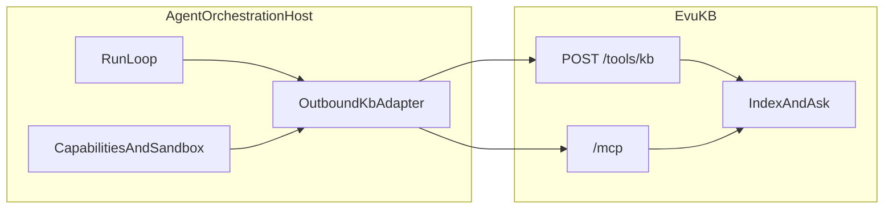
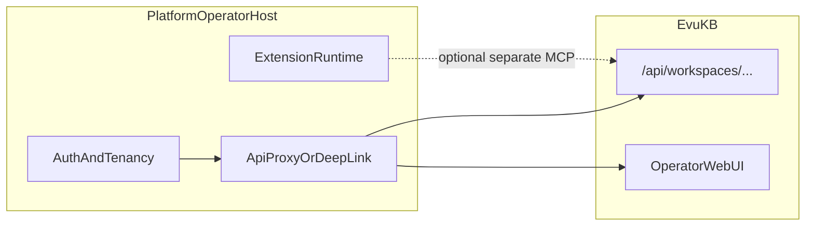

# EvuKB Host Integration Shapes

This guide describes **two common host consumption patterns** beyond the raw
transport details in [`INTEGRATION.md`](./INTEGRATION.md). Use it after you have
chosen OpenAPI HTTP, `@evu/kb-sdk`, MCP, or `POST /tools/kb`, and need a clear
split of responsibilities between your host application and EvuKB.

Related docs:

- [`INTEGRATION.md`](./INTEGRATION.md) — workspace mapping, auth scopes, SDK/MCP/tool examples
- [`AUTH.md`](./AUTH.md) — API keys, MCP tokens, production gates
- [`EMBED.md`](./EMBED.md) — in-process `@evu/kb-server` bootstrap
- [`examples/integration/`](../examples/integration/) — reusable JSON contract fixtures
- [`SPEC.md`](../SPEC.md) §25 and §30 — normative tool and integration contracts

EvuKB remains a generic knowledge-base product. Host-specific adapter code belongs
in the consuming project unless it is generic and free of host-runtime concepts.

---

## Which pattern applies?

| Question | Pattern |
| --- | --- |
| Does your host run agent workflows, tool loops, sandbox policy, and outbound tool routing? | **Agent orchestration host** |
| Does your host provide org auth, operator UI, extensions, and platform-wide graphs while exposing KB to users? | **Platform operator host** |

A single product may use both patterns in different surfaces (for example, an
operator console that deep-links to EvuKB **and** a background agent runtime that
calls `POST /tools/kb`). Keep adapters separate so each boundary stays explicit.

---

## Pattern 1 — Agent orchestration host

Use this shape when the host owns **run lifecycle** and agents call knowledge
tools through an outbound adapter. EvuKB owns indexing, search, Ask, citations,
and KB mutation policy.

### Responsibility split

| Concern | Host owns | EvuKB owns |
| --- | --- | --- |
| Run / workflow lifecycle | yes | no |
| Agent memory banks (session, TTL, consolidation, run injection) | yes | no |
| Tool loop and outbound routing to KB | yes (adapter calls EvuKB) | no |
| Capability grants and sandbox before KB writes | yes | mutation policy and pending approvals inside KB |
| Budgets and billing | yes (may map EvuKB usage telemetry) | usage records for KB-owned operations only |
| Parsing, chunking, embeddings, links, vectors | no | yes |
| Search, Ask, corpus graph | no | yes |
| Audit of host workflow decisions | yes | audit of KB mutations |
| Second KB index inside the host | **forbidden** | single source of truth |
| Durable agent-authored corpus files (`agent-notes/`) | no | yes (today: `agent-notes/` only; see AGENT-2) |

### Topology



### Primary EvuKB surfaces

The host outbound adapter should map agent tool calls to one of:

| Surface | When |
| --- | --- |
| `POST /api/workspaces/{workspaceId}/tools/kb` | JSON action bridge; same action enum as MCP |
| MCP Streamable HTTP at `{apiOrigin}/mcp` | IDE or harness with tool discovery |
| `@evu/kb-sdk` | TypeScript host process co-located with the run loop |

Read actions (`list_corpora`, `search`, `ask`, `get_document`, …) and write
actions (`create_document`, `append_document`, …) share semantics across all
three surfaces. See [`INTEGRATION.md`](./INTEGRATION.md) §6–§7 and [`SPEC.md`](../SPEC.md) §25.

### Capability mapping

The host maps **run capabilities** to EvuKB credentials:

1. Resolve the EvuKB workspace id or slug for the run tenant.
2. Mint or select an API key or MCP token with `kb:read` and/or `kb:write`.
3. Optionally enforce corpus ids, path prefixes, or action allowlists in the host
   adapter **before** calling EvuKB (EvuKB still enforces workspace scope and
   mutation policy server-side).

Write tools may return `pending_approval` when corpus mutation policy requires
human or operator review. The host should surface that status to the run; approval
happens through EvuKB's approval API, not by bypassing EvuKB.

### Optional pre-run context

Before starting a run, the host may call EvuKB search or Ask and inject snippets
into its own prompt or run context. EvuKB remains **on-demand**; the host must
not build or maintain a parallel chunk index. Refresh context by calling EvuKB
again when the run needs updated retrieval.

### Anti-patterns

- Duplicating markdown parse/chunk/embed logic in the host.
- Storing corpus content only in the host and treating EvuKB as an optional cache.
- Ignoring `pending_approval` or workspace isolation errors from EvuKB.

### Where adapter code lives

Outbound KB adapters, capability matrices, and run-scoped token minting belong
in the **consuming project**, not in the EvuKB repository.

---

## Pattern 2 — Platform operator host

Use this shape when the host is an **organization or product shell**: human auth,
tenancy, extensions, service discovery, and platform-wide observability. EvuKB
provides corpora, files, search, Ask, and corpus-level link graphs.

### Responsibility split

| Concern | Host owns | EvuKB owns |
| --- | --- | --- |
| Human auth, org / project hierarchy | yes | workspace rows and scoped tokens |
| Extension lifecycle, platform MCP gateway | yes | KB MCP on the EvuKB API port |
| Service maps, collectors, platform timeline / graph | yes | corpus link graph and KB graph API only |
| Documents, search, Ask, KB graph | proxy, embed, or deep-link | yes |
| KB indexing and blob storage | no | yes |
| Adapter / proxy code | consuming project | — |

### Topology



### Integration modes

| Mode | Description |
| --- | --- |
| **Reverse proxy** | Host terminates user auth and forwards `/api/workspaces/…` and `/mcp` to EvuKB with service credentials |
| **Deep link** | Host links operators to standalone [`apps/web`](../apps/web) (or a deployed EvuKB UI) with workspace context in the URL or session |
| **Embed server** | Host mounts [`@evu/kb-server`](./EMBED.md) in-process and applies its own auth middleware before KB routes |

Pick one primary mode per surface. Mixing proxy and deep-link is fine when
operator tasks (browse files) use the EvuKB UI and programmatic clients use the API.

### Workspace mapping

Map each host tenant, organization, or project to an EvuKB **workspace id or slug**.
Store EvuKB API keys or MCP tokens per tenant with least-privilege scopes. See
[`INTEGRATION.md`](./INTEGRATION.md) §2–§3.

The host authenticates humans; EvuKB validates bearer tokens on each KB request.
Do not expose long-lived write tokens to browser clients unless your threat model
accepts that risk.

### What not to duplicate in EvuKB

These stay in the platform host unless `SPEC.md` is updated first:

- Organization billing and cross-workspace usage rollups (EvuKB exposes per-workspace usage; hosts aggregate)
- Platform service maps and dependency graphs unrelated to corpus wikilinks
- Extension install/update lifecycle and platform-wide MCP registries
- Automation run inboxes, review queues outside KB mutation approvals

EvuKB's operator UI covers KB/RAG workflows only (corpora, files, search, ask,
settings, diagnostics).

---

## Standalone and embedded deployment

Standalone and embedded EvuKB are equally valid and may be used interchangeably.
Neither pattern implies memory banks belong inside EvuKB.

A common combined setup:

- **Standalone EvuKB** indexes an Obsidian vault via mount or git import.
- **Humans** edit the vault in Obsidian (or the EvuKB file manager).
- **Agents** in a separate orchestration host call EvuKB over MCP or
  `POST /tools/kb` for retrieval and `agent-notes/` writes.

Knowledge stays in EvuKB; session memory, TTL, and run injection stay in the host.
If a dedicated memory product is needed later, it should be a separate project (for
example EvuMemory), not an expansion of EvuKB core. See [`SPEC.md`](../SPEC.md) §16.

Operators who want agent-authored content isolated from human knowledge can dedicate
a corpus to agent writes. Planned settings (AGENT-1) will control whether
`agent-notes/` paths appear in Ask/search context (workspace default true, corpus
override).

---

## Out of scope for EvuKB

Regardless of pattern, the following belong in the host unless the product boundary
in [`SPEC.md`](../SPEC.md) changes:

- Host user identity and session management (see [`AUTH.md`](./AUTH.md))
- Agent memory banks (session/run memory, consolidation, TTL)
- Agent run orchestration, sandboxing, and outbound tool registries (Pattern 1)
- Platform extensions, service maps, and org-level graphs (Pattern 2)
- Git writeback implementation ([`GIT-WRITEBACK.md`](./GIT-WRITEBACK.md) design only; SYNC-6 open)

---

## Contract testing

Host projects can reuse JSON fixtures under [`examples/integration/`](../examples/integration/)
in their own contract tests without importing EvuKB server code. Validate fixture
actions in CI with:

```bash
pnpm test packages/kb-core/test/integration-fixtures.test.ts
```
